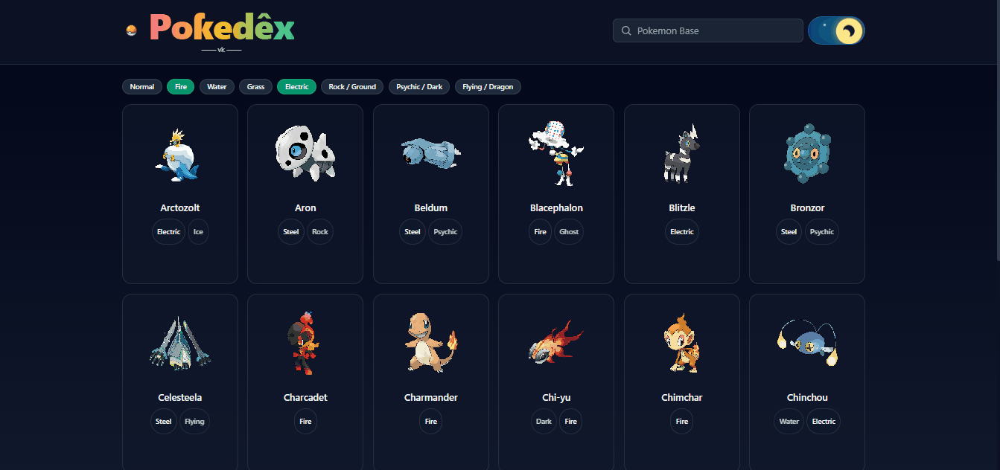
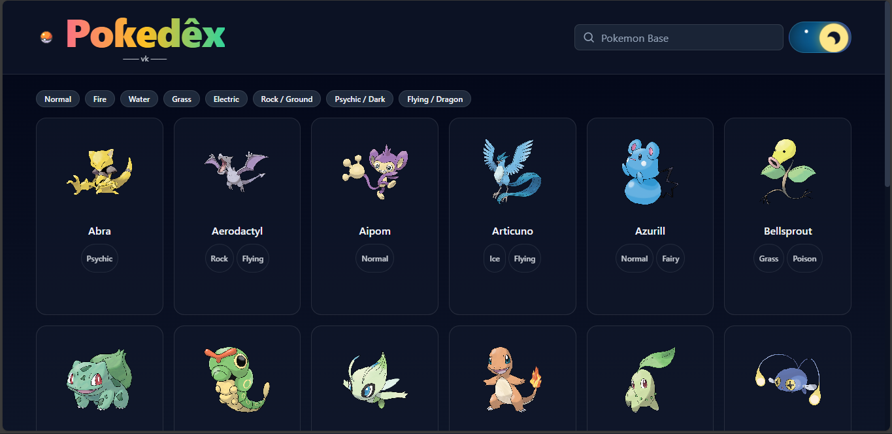
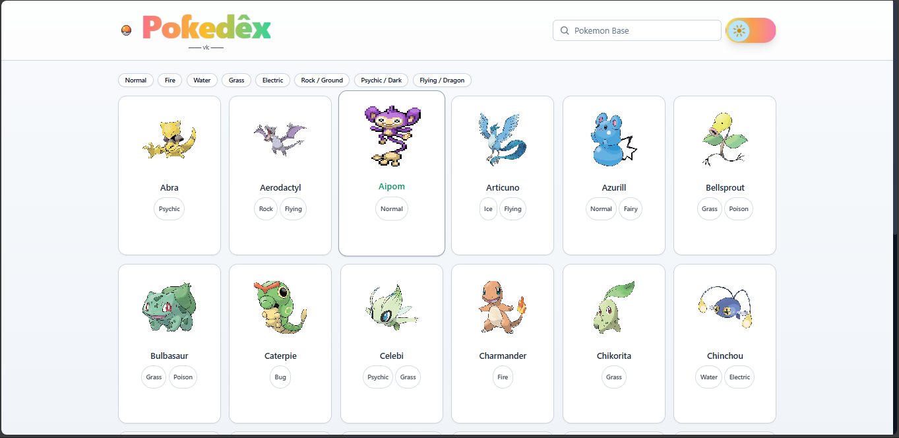
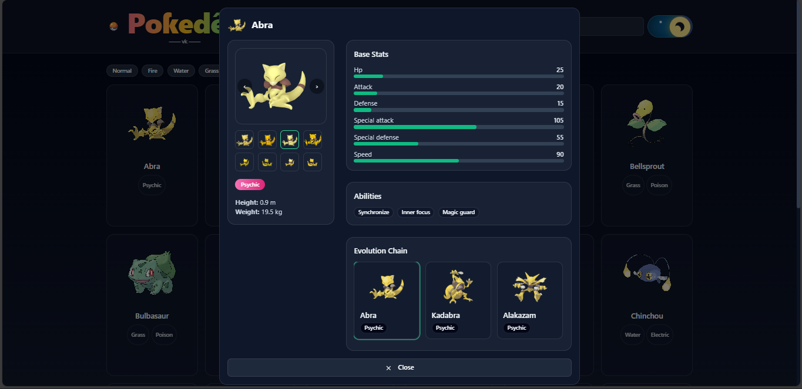
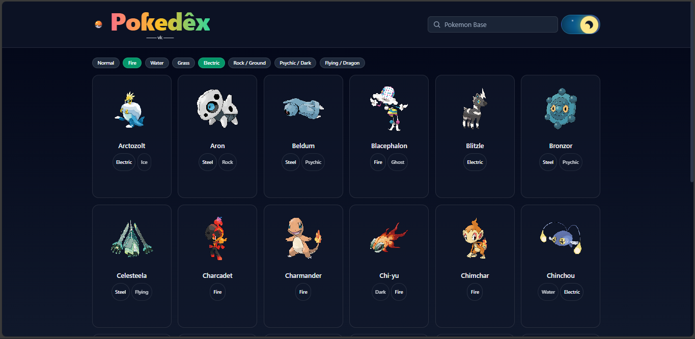

# 🧭 Pokedex — React + TypeScript + Vite

[](#)
[](#)
[](LICENSE)

A clean, fast Pokedex with day/night UI, grouped type filters, base-form browsing, and hover GIFs (when available). Fully responsive (mobile + desktop).

---

## 🔗 Live Demo

**URL:** https://your-vercel-domain.vercel.app  
**Video/GIF Preview:**

> Replace the file below with your own capture (see “How to add images/GIFs”).
>
> 

---

## 🖼️ Screenshots

> Put your screenshots in `public/preview/` and update the paths.

<p align="center">
  
  
</p>

<p align="center">
  
  
</p>

---

## ✨ Features

- 🌗 **Day/Night toggle** with tasteful gradients
- 🔎 **Search** by base name; typing an evolved name smart-resolves its base form
- 🧩 **Type group filters** (e.g., *Water → (Water, Ice)*, *Psychic/Dark → (Psychic, Ghost, Dark)*)
- 🖼️ **Consistent card sizing** + hover scale
- 🌀 **Animated sprites on hover** (Gen V BW GIFs, with graceful fallback)
- 📱 **Responsive** (mobile & desktop)
- 🧰 Zero external UI frameworks—just small inline primitives

---

## 🧠 Tech Stack

- **React + TypeScript + Vite**
- **TailwindCSS** (utility classes)
- **PokeAPI** for data

---

## 🚀 Local Development

```bash
# 1) Install deps
npm install

# 2) Start dev server
npm run dev
# open the printed http://localhost:5173/

## 🧾 License

This project is licensed under the **MIT License**.  
See the full text in [`LICENSE`](./LICENSE).
